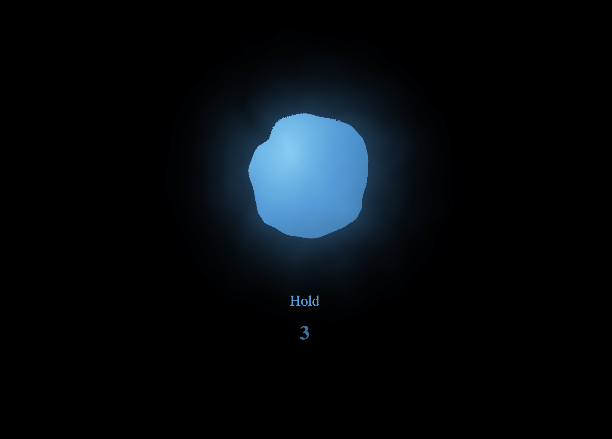

# 🌬️ Breath Tool – 4-7-8 Breathing App

[](https://www.typescriptlang.org/)


[](LICENSE)


A calming visual tool to guide users through the 4-7-8 breathing technique. Built with **React** and **Framer Motion**, the animations mimic a natural, organic breathing rhythm with glowing and ripple effects for a soothing experience.

---

## ✨ Features

- 🌟 Animated breath cycle with stages: **Inhale (4s) → Hold (7s) → Exhale (8s)**
- 💨 Expanding and contracting **glowing circle** to guide breath
- 🌀 **SVG filter effects** for ripple-like texture (works in modern browsers)
- ⚙️ Built with `Vite`, `React`, and `Framer Motion` for smooth animations
- 💅 Fully customizable styling using CSS

---

## 📸 Screenshot



---

## 🚀 Getting Started

Clone and run the app locally:

```bash
git clone https://github.com/jassakoch/breath-tool.git
cd breath-tool
npm install
npm run dev 
```


🛠️ Built With
React

Framer Motion – for smooth, lifelike animations

Vite – for fast development server and builds

CSS Filters & SVG – to simulate ripple and glow effects


## License
MIT 

## ACKNOWLEDGEMENTS

Huge thanks to the creators of Framer Motion for making animation feel organic.

Feel free to fork and customize your own breatking patterns or mindfullness tools.
